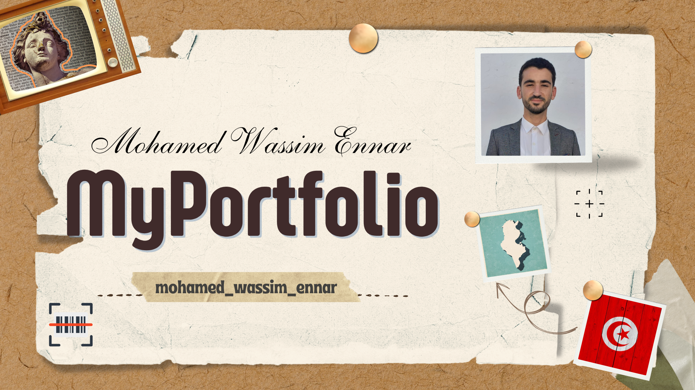

# Mon Portfolio

Voici mon portfolio, un site web qui présente des informations sur moi, y compris :

- **À propos de moi** : Découvrez qui je suis et mon parcours.
- **Projets** : Un aperçu des projets que j'ai réalisés.
- **Compétences** : Les compétences techniques et personnelles que j'ai acquises.
- **Expériences** : Mon expérience professionnelle et académique.
- **Contact** : Comment me joindre pour des opportunités ou des collaborations.
- **Centres d'intérêt** : Mes hobbies et passions en dehors du travail.

Ce portfolio a été réalisé avec **JavaScript, HTML et CSS**.
